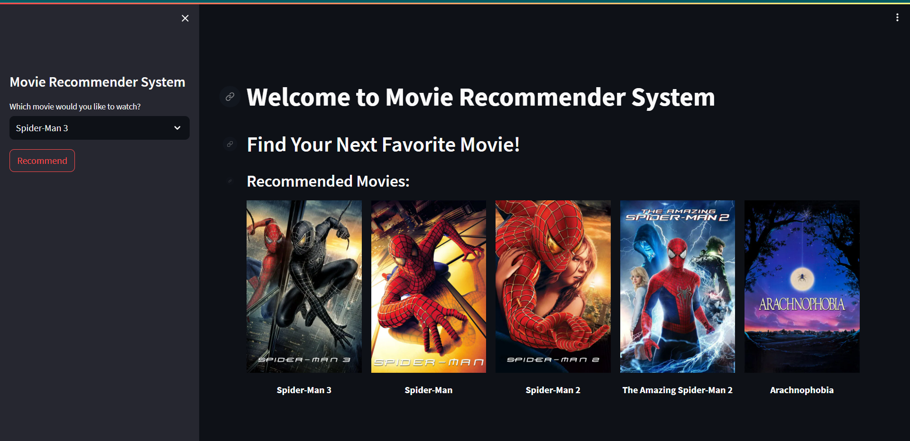

# 🎬 Movie Recommendation System

An interactive web app built with Streamlit and Python that suggests movies you’ll love based on your selection. It uses a precomputed similarity matrix and The Movie DB API to fetch posters, giving you five hand-picked recommendations in seconds.

---

## 🗓️ Project Timeline

* **Second Year (July 2023):** Developed the initial prototype during my 2nd year.

---

## 🧠 Features

* **Movie Similarity Engine**
  Uses a pre-trained similarity matrix (cosine similarity on movie metadata) to find the closest matches.

* **Dynamic Poster Fetching**
  Calls The Movie DB API to display official movie posters alongside recommendations.

* **Streamlit-Powered UI**
  Responsive, easy-to-use sidebar for selecting a movie and viewing results in a clean, five‑column layout.

* **Lightweight & Fast**
  All computations use pre-built pickle files (`movies_dict.pkl`, `similarity.pkl`) for instant recommendations.

---
📸 Demo & Screenshot

---

## 🛠️ Installation

1. Clone the repo

```bash
git clone https://github.com/yourusername/movie-recommender.git
cd movie-recommender
```

2. Create & activate a virtual environment (optional but recommended)

```bash
python3 -m venv venv
source venv/bin/activate   # macOS/Linux
venv\Scripts\activate      # Windows
```

3. Install dependencies

```bash
pip install streamlit pandas requests
```

4. Add your TMDB API key

* Rename `config_example.py` to `config.py`
* Insert your key:

  ```python
  TMDB_API_KEY = "your_api_key_here"
  ```

5. Place the pickle files

* `movies_dict.pkl`
* `similarity.pkl`

---

## 🚀 Usage

Run the app with Streamlit:

```bash
streamlit run app.py
```

* Use the sidebar to select a movie title
* Click **Recommend**
* View your top 5 recommended titles and posters

---

## 📁 File Structure

```
.
├── app.py               # Main Streamlit application
├── config_example.py    # API key placeholder
├── movies_dict.pkl      # Serialized movie metadata
├── similarity.pkl       # Precomputed similarity matrix
├── requirements.txt     # Python dependencies
└── README.md            # This documentation
```

---

## 💡 Future Plans

* 📺 Add trailers & movie details (runtime, genres)
* 🌐 Integrate user ratings & collaborative filtering
* 📈 Display recommendation confidence scores
* 🎨 Polish UI with custom themes and animations

---

## 🤝 Contributing

1. Fork the repo
2. Create a feature branch (`git checkout -b feature/foo`)
3. Commit your changes (`git commit -am 'Add foo feature'`)
4. Push to the branch (`git push origin feature/foo`)
5. Open a Pull Request

---

## 📜 License

This project is open-source for educational purposes. See [LICENSE](LICENSE) for details.

